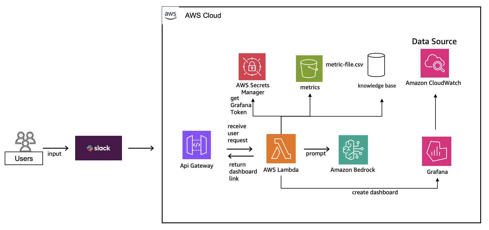
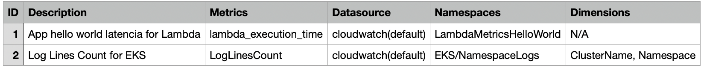

# AI-Powered Dashboard Management System

This project automates the creation, update, and deletion of Grafana dashboards using Generative AI (Amazon Bedrock) integrated with Slack. The system enables natural language commands to manage Kubernetes (EKS) cluster metrics dashboards through simple Slack slash commands.

**This project is intended for educational and demonstration purposes**

### Architecture Overview




### Project Structure

```bash
folder/
├── dashboard-management-infrastructure.yaml
├── create-dashboard/
│   ├── app.py
│   ├── Dockerfile
│   └── requirements.txt
├── update-dashboard/
│   ├── app.py
│   ├── Dockerfile
│   └── requirements.txt
└── delete-dashboard/
    ├── app.py
    ├── Dockerfile
    └── requirements.txt
```

### Features

- **Natural Language Processing**: Create dashboards using plain English commands
- **AI-Powered Metric Selection**: Automatically finds relevant metrics from Container Insights
- **Knowledge Base Integration**: Uses RAG (Retrieval Augmented Generation) for context-aware responses
- **Slack Integration**: Simple slash commands for dashboard management
- **Automated Validation**: Ensures only existing metrics are used in dashboards

## Prerequisites

Before deploying this solution, ensure you have the following configured:

- **AWS CLI** - [AWS Command Line Interface](https://aws.amazon.com/cli/) installed and configured with credentials
- **Grafana Workspace** - Grafana workspace configured with API token (Editor or Admin role)
- **Amazon ECR Repositories** - Three ECR repositories created with Lambda container images pushed:
  - `lambda-create-dashboard`
  - `lambda-update-dashboard`
  - `lambda-delete-dashboard`
- **Amazon Bedrock Model** - Claude Sonnet 4.5 (`anthropic.claude-sonnet-4-5-20250929-v1:0`) enabled in your AWS account
- **Knowledge Base for Container Insights** - Amazon Bedrock Knowledge Base created and populated with Container Insights documentation ([Guide](https://docs.aws.amazon.com/bedrock/latest/userguide/knowledge-base-create.html))
- **CloudWatch Metrics** - EKS cluster with metrics being collected in CloudWatch (Container Insights enabled)
- **Metric-file.csv** that contains some your custom metrics collected by CloudWatch
- **VPC Configuration** - VPC with private subnets and NAT Gateway or VPC Endpoints for Lambda connectivity
- **Slack Workspace** - Slack workspace with slash commands configured ([Guide](https://api.slack.com/interactivity/slash-commands))
- **Slack Signing Secret** - Found in your Slack App settings 

****
**Estimated time:** 10-20 minutes (after prerequisites are met)  
**Estimated cost:** Costs vary based on usage. You'll incur charges for Lambda execution, Bedrock API calls, API Gateway requests, and data transfer. Remember to clean up resources after testing.
****

## Deployment

### Step 1: Deploy CloudFormation Stack

```bash
# Clone the repository
git clone <repository-url>
cd <repository_directory>

# Set your AWS region
export AWS_REGION=<region>
export AWS_ACCOUNT_ID=$(aws sts get-caller-identity --query Account --output text)

# Deploy CloudFormation stack
aws cloudformation create-stack \
    --stack-name dashboard-management-system \
    --template-body file://dashboard-management-infrastructure.yaml \
    --parameters \
        ParameterKey=SubnetIds,ParameterValue="subnet-xxx,subnet-yyy" \
        ParameterKey=SecurityGroupIds,ParameterValue="sg-xxx" \
        ParameterKey=CreateImageUri,ParameterValue="$AWS_ACCOUNT_ID.dkr.ecr.$AWS_REGION.amazonaws.com/lambda-create-dashboard:latest" \
        ParameterKey=UpdateImageUri,ParameterValue="$AWS_ACCOUNT_ID.dkr.ecr.$AWS_REGION.amazonaws.com/lambda-update-dashboard:latest" \
        ParameterKey=DeleteImageUri,ParameterValue="$AWS_ACCOUNT_ID.dkr.ecr.$AWS_REGION.amazonaws.com/lambda-delete-dashboard:latest" \
        ParameterKey=GrafanaEndpoint,ParameterValue="https://your-grafana-url.com" \
        ParameterKey=GrafanaApiToken,ParameterValue="your-grafana-token" \
        ParameterKey=SlackSigningSecret,ParameterValue="your-slack-signing-secret" \
        ParameterKey=ContainerInsightKBId,ParameterValue="YOUR_KB_ID" \
        ParameterKey=S3BucketName,ParameterValue="your-metrics-bucket" \
    --capabilities CAPABILITY_NAMED_IAM \
    --region $AWS_REGION

# Wait for stack creation
aws cloudformation wait stack-create-complete \
    --stack-name dashboard-management-system \
    --region $AWS_REGION

# Get API Gateway URL for Slack configuration
aws cloudformation describe-stacks \
    --stack-name dashboard-management-system \
    --query 'Stacks[0].Outputs[?OutputKey==`ApiGatewayUrl`].OutputValue' \
    --output text
```

> **Note:** If the `:latest` tag doesn't work for the image URI parameters, use the image digest (SHA) instead:  
> `$AWS_ACCOUNT_ID.dkr.ecr.$AWS_REGION.amazonaws.com/lambda-create-dashboard@sha256:<digest>`  
> You can get the digest with: `aws ecr describe-images --repository-name lambda-create-dashboard --query 'imageDetails[0].imageDigest' --output text`

### Step 2: Upload Metrics CSV to S3

After the CloudFormation stack is created, upload your metrics CSV file to the S3 bucket:

```bash
# Upload metrics CSV file
aws s3 cp metricas.csv s3://your-metrics-bucket/metricas.csv

# Verify upload
aws s3 ls s3://your-metrics-bucket/
```

**CSV Format Example:**



### Step 3: Configure Slack Slash Commands

After deployment, configure your Slack slash commands with the API Gateway URLs:

| Command | Request URL |
|---------|-------------|
| `/create-dashboard` | `https://<api-id>.execute-api.<region>.amazonaws.com/<stage>/<path>/create-dashboard` |
| `/update-dashboard` | `https://<api-id>.execute-api.<region>amazonaws.com/<stage>/<path>/update-dashboard` |
| `/delete-dashboard` | `https://<api-id>.execute-api.<region>.amazonaws.com/<stage>/<path>/delete-dashboard` |

## Usage Examples

**Create a new dashboard:**
```
/create-dashboard Create a dashboard for EKS cluster monitoring with CPU and memory metrics
```

**Update existing dashboard:**
```
/update-dashboard My EKS Dashboard Name, add visualization with number of running pods
```

**Delete dashboard:**
```
/delete-dashboard Delete dashboard My EKS Dashboard Name
```

**Delete specific panel:**
```
/delete-dashboard Delete panel CPU Usage from dashboard My EKS Dashboard Name
```

## CloudFormation Parameters

| Parameter | Type | Default | Description |
|-----------|------|---------|-------------|
| **S3BucketName** | String | `datasource-repository-okokok` | S3 bucket containing metrics CSV file |
| **SubnetIds** | CommaDelimitedList | - | VPC subnet IDs for Lambda functions (comma-separated) |
| **SecurityGroupIds** | CommaDelimitedList | - | Security group IDs for Lambda functions |
| **ApiName** | String | `observability-mgn` | API Gateway name |
| **StageName** | String | `prod` | API Gateway deployment stage |
| **CreateFunctionName** | String | `lambda-create-dashboard` | Create Lambda function name |
| **CreateImageUri** | String | - | ECR image URI for create dashboard Lambda |
| **CreatePromptName** | String | `lambda_create_dashboard_prompt` | Bedrock prompt name for create |
| **CreatePromptDescription** | String | - | Description for create prompt |
| **UpdateFunctionName** | String | `lambda-update-dashboard` | Update Lambda function name |
| **UpdateImageUri** | String | - | ECR image URI for update dashboard Lambda |
| **UpdatePromptName** | String | `lambda_update_dashboard_prompt` | Bedrock prompt name for update |
| **UpdatePromptDescription** | String | - | Description for update prompt |
| **DeleteFunctionName** | String | `lambda-delete-dashboard` | Delete Lambda function name |
| **DeleteImageUri** | String | - | ECR image URI for delete dashboard Lambda |
| **DeletePromptName** | String | `lambda_delete_dashboard_prompt` | Bedrock prompt name for delete |
| **DeletePromptDescription** | String | - | Description for delete prompt |
| **ContainerInsightKBId** | String | - | Knowledge Base ID for Container Insights documentation |
| **InferenceProfileId** | String | `us.anthropic.claude-sonnet-4-5-20250929-v1:0` | Bedrock inference profile ID |
| **GrafanaEndpoint** | String | - | Grafana workspace URL |
| **GrafanaApiToken** | String | - | Grafana API token (stored in Secrets Manager) |
| **SlackSigningSecret** | String | - | Slack Signing Secret for request verification (stored in Secrets Manager) |
| **GrafanaSecretName** | String | `GRAFANA_TOKEN` | Secrets Manager secret name |

## Clean Up Resources

**Important: Always clean up to avoid charges!**

```bash
# Delete CloudFormation stack
aws cloudformation delete-stack \
    --stack-name dashboard-management-system \
    --region $AWS_REGION

# Wait for deletion to complete
aws cloudformation wait stack-delete-complete \
    --stack-name dashboard-management-system \
    --region $AWS_REGION

# Verify stack deletion
aws cloudformation describe-stacks \
    --stack-name dashboard-management-system \
    --region $AWS_REGION
# Should return: "Stack with id dashboard-management-system does not exist"
```

## Important Notes

**Slack Request Verification:**  
All incoming requests are verified using the Slack Signing Secret (HMAC-SHA256). This ensures only requests from your authorized Slack workspace are processed. The signing secret is stored securely in AWS Secrets Manager and encrypted with KMS. Requests with invalid signatures or timestamps older than 5 minutes are rejected.

**AI Model Behavior:**  
This solution uses Generative AI (Claude Sonnet 4.5) which is non-deterministic by nature. Results may vary between requests even with identical inputs. If the generated dashboards don't meet your specific requirements, you may need to adjust the prompts in the CloudFormation template (`UpdateDashboardPrompt`, `CreateDashboardPrompt`, `DeleteDashboardPrompt`) to better suit your use case.

The prompts can be modified directly in the `dashboard-management-infrastructure.yaml` file before deployment or updated after deployment through the cloudformation.

## Learn More

- [Amazon Bedrock Documentation](https://docs.aws.amazon.com/bedrock/)
- [Amazon Bedrock Knowledge Bases](https://docs.aws.amazon.com/bedrock/latest/userguide/knowledge-base.html)
- [Container Insights for EKS](https://docs.aws.amazon.com/AmazonCloudWatch/latest/monitoring/Container-Insights-setup-EKS-quickstart.html)
- [AWS Lambda Container Images](https://docs.aws.amazon.com/lambda/latest/dg/images-create.html)
- [Slack Slash Commands](https://api.slack.com/interactivity/slash-commands)

## License

This library is licensed under the MIT-0 License. See the LICENSE file.
